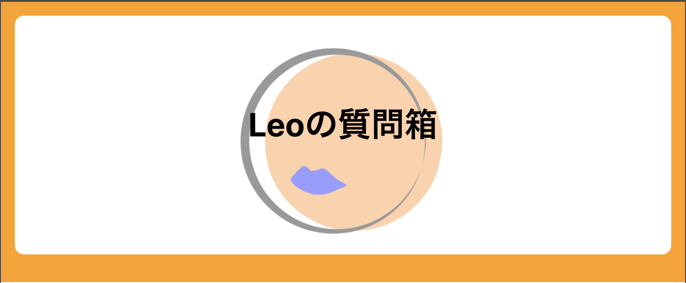
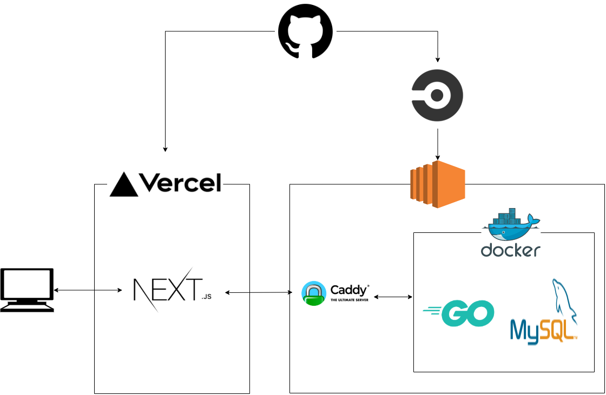

# 質問箱

## アーキテクチャ

- バックエンドはGoで書かれており、RDBはMySQL、EC2上でDockerを立ち上げてます。
- フロントはTypeScript,Reactで書かれており、S3で静的ホスティングしています。
- APIはREST APIです。

## 記事
[質問箱を自作しました](https://le0tk0k.hatenablog.com/entry/2020/10/28/113828)